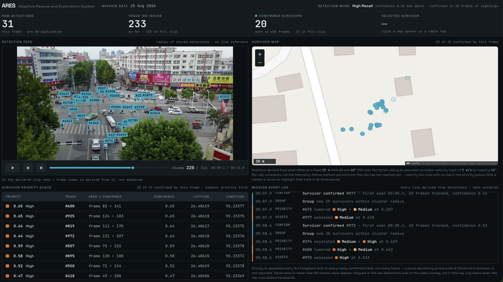

# Hosting the ARES site on your own domain

GitHub Pages, free, deploys on push, no server that can die on demo day.

---

## 1. Put the site in the repo

```bash
cd ~/Project/ARES
mkdir -p docs/site/img
# drop index.html into docs/site/
```

Final shape:

```
docs/
├── handbook/          the 12-part handbook + field manual
└── site/
    ├── index.html     the public pitch site
    ├── CNAME          your domain (created in step 3)
    └── img/
        ├── dashboard-full.png
        ├── dashboard-map.png
        └── dashboard-overlay.png
```

---

## 2. The three screenshots

The site has labelled slots where these go. Take them at **1280×720** — projector
resolution, and the width the dashboard layout is designed for.

| File | What to capture |
|---|---|
| `dashboard-full.png` | Whole dashboard, mid-playback, several survivors confirmed |
| `dashboard-map.png` | Map panel + rescue queue, one survivor selected so the pin and row are both highlighted |
| `dashboard-overlay.png` | Video panel close-up with detection boxes visible |

**Pick a frame where the counts are interesting** — say 15 confirmed of 23, so
the header's three numbers are visibly different from each other. A frame with
everything confirmed makes the filtering invisible.

Then replace each placeholder block in `index.html`. Find:

```html
<div class="shot">
  <div class="h">Command dashboard — full view</div>
  <div class="f">replace with: docs/img/dashboard-full.png</div>
</div>
```

Replace with:

```html
<div class="shot">
  
</div>
```

The `.shot` class already handles the sizing and the rounded corners.

---

## 3. Point the domain

Create `docs/site/CNAME` containing **only** your domain, no protocol, no slash:

```
ares.yourdomain.com
```

Then at your registrar, add a **CNAME record**:

| Type | Name | Value |
|---|---|---|
| CNAME | `ares` | `dewangdhakad.github.io` |

If you want the site at the bare domain instead of a subdomain, that needs four
`A` records rather than a CNAME — a subdomain is simpler and there is no reason
to fight it eleven days out.

---

## 4. Turn on Pages

```bash
git add docs/site
git commit -m "Add public ARES site"
git push
```

Then on GitHub: **Settings → Pages**

- Source: **Deploy from a branch**
- Branch: `main`, folder: **`/docs`**
- Custom domain: your domain
- Tick **Enforce HTTPS** once the certificate provisions (can take an hour)

With the folder set to `/docs`, the site serves from `docs/site/` at
`yourdomain.com/site/`. **Cleaner alternative:** move `index.html` to `docs/` and
keep the handbook in `docs/handbook/` — then the site is at the domain root and
the handbook is at `/handbook/`. That is the layout I'd use.

DNS takes up to an hour. **Do this today, not on 4 September.**

---

## 5. The QR code

```bash
pip install qrcode[pil]
python3 -c "
import qrcode
qrcode.make('https://ares.yourdomain.com').save('docs/site/img/qr.png')
"
```

Send that PNG to Ujjaini for slides 1 and 7.

---

## 6. Verify before you call it done

- [ ] Loads on a phone, no horizontal scrolling
- [ ] Loads in light mode *and* dark mode — the page follows the viewer's theme
- [ ] All three screenshots present, none stretched
- [ ] The GitHub links point at the right repo (`dewangdhakad/ARES` — update if
      the team org repo is canonical)
- [ ] The funnel animates on scroll, and the numbers land on 7,081 / 333 / 23
- [ ] HTTPS enforced, no certificate warning
- [ ] Open it once with wifi off to confirm nothing is silently loading from a
      CDN — the only external request should be Google Fonts

---

## Two things to remember

**The deck must stand alone.** The site is depth for a judge who is already
interested. Never put required content only on the site — venue wifi fails, and a
slide that says "see our website for the results" is a slide with no results.

**The site is the pitch, not the handbook.** The handbook has a section listing
fourteen of your own mistakes, which is exactly right for you and exactly wrong
for a judge reading cold. Keep them separate. Link the handbook from the site if
you want, but do not merge them.
